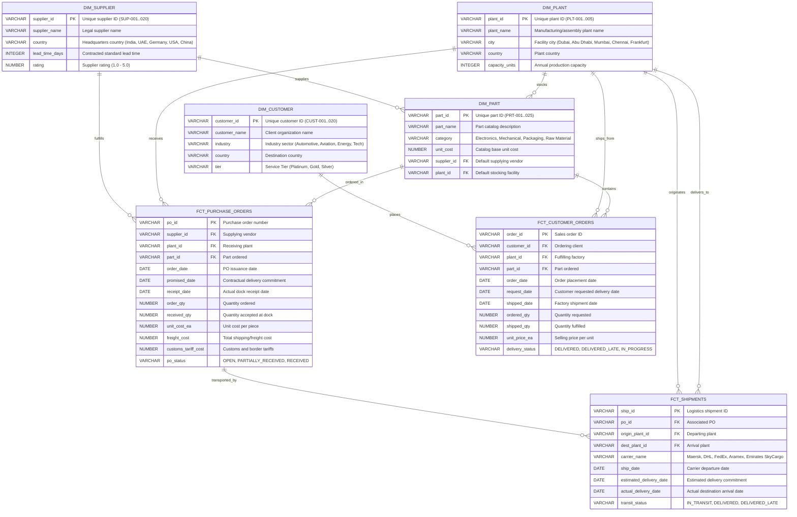

# Governed Supply Chain Ontology & Conversational Analytics
### Snowflake CoCo CLI Hackathon 2026 — GCC Edition

[](https://www.snowflake.com/)
[](https://docs.snowflake.com/)
[](https://streamlit.io/)

---

## 1. Executive Summary

In enterprise supply chains, data is fragmented across ERP, logistics, and planning silos. When leadership asks a fundamental question:
> *"What is our on-time delivery rate?"*

Different teams return contradictory answers:
* **Procurement:** **83.0%** (measured against supplier promised delivery date on purchase orders)
* **Logistics:** **93.2%** (measured against carrier transit SLA on shipments)
* **Planning / Sales:** **89.5%** (measured against customer requested date and order fill quantity)
* **Ungoverned LLM Chatbot:** **0.0%** (hallucinated single-table query with integer-division truncation)

### The Solution:
We built a **unified enterprise Supply Chain Ontology** encoded into a governed **Snowflake Semantic Model** (`supply_chain_ontology.yaml`) and deployed via **Cortex Analyst**. When an executive or manager asks a business question:
1. Cortex Analyst parses the intent against semantic relationships and verified queries.
2. The question routes to deterministic canonical formulas.
3. Every answer is returned with audited SQL transparency, data lineage, and mathematical safety guards.

---

## 2. Architecture & Data Flow

```
┌─────────────────────────────────────────────────────────────────┐
│                        USER INTERACTION                         │
│  Streamlit App (Persona selector + NL question + results)       │
│  CoCo CLI (Developer / testing interface)                       │
│  MCP Agent (Claude / external tool actions)                     │
└───────────────────────────┬─────────────────────────────────────┘
                            │
                   ┌────────▼────────┐
                   │  CORTEX ANALYST  │  ← Natural Language → Governed SQL
                   │  (REST API)     │     using Semantic Model YAML
                   └────────┬────────┘
                            │
               ┌─────────────▼──────────────┐
               │   SEMANTIC ONTOLOGY LAYER  │  ← Ground truth business model
               │   @SEMANTIC_MODELS_STAGE   │
               │   ┌─────────────────────┐  │
               │   │ 7 Tables            │  │  ← Normalized entities
               │   │ 11 Relationships    │  │  ← Referential join graph
               │   │ 25+ Dimensions      │  │  ← Business attributes & synonyms
               │   │ 4 Canonical Metrics │  │  ← Governed enterprise formulas
               │   │ 14 Verified Queries │  │  ← Golden Q→SQL deterministic pairs
               │   └─────────────────────┘  │
               └─────────────┬──────────────┘
                             │
          ┌──────────────────▼──────────────────┐
          │        SNOWFLAKE ANALYTICS          │
          │  ┌──────────┐  ┌───────────────────┐ │
          │  │ DIM_*    │  │ FCT_*             │ │
          │  │ Supplier │  │ Purchase_Orders   │ │
          │  │ Part     │  │ Shipments         │ │
          │  │ Plant    │  │ Customer_Orders   │ │
          │  │ Customer │  └───────────────────┘ │
          │  └──────────┘           ▲           │
          │                         │           │
          │   DYNAMIC TABLE (Incremental Sync)  │
          │   DT_ENTERPRISE_OTD_HOURLY          │
          └─────────────────────────┬───────────┘
                                    │
               ┌────────────────────┴────────────────────┐
               │           UNSTRUCTURED AI LAYER         │
               │   contracts/supplier_sla_agreement.txt  │
               │      ↓ (SNOWFLAKE.CORTEX.COMPLETE)      │
               │   V_SLA_VS_ACTUAL_OTD (Breach Detection)│
               └─────────────────────────────────────────┘
```

---

## 3. Entity Relationship Diagram (ERD)



---

## 4. Understanding the Data & Why We Transform It to an Ontology

### 4.1 What the Data Represents
The database models an end-to-end global manufacturing supply chain with **1,980 referentially consistent rows**:
1. **Upstream Procurement (`DIM_SUPPLIER`, `DIM_PART`, `FCT_PURCHASE_ORDERS`)**: 20 tier-1 suppliers across 5 countries fulfilling 500 purchase orders with granular unit costs, freight tariffs, promised dates, and dock receipt timestamps.
2. **Midstream Logistics (`DIM_PLANT`, `FCT_SHIPMENTS`)**: 5 manufacturing hubs connected through 600 multi-modal freight shipments with carrier transit tracking (estimated vs. actual arrival).
3. **Downstream Customer Fulfillment (`DIM_CUSTOMER`, `FCT_CUSTOMER_ORDERS`)**: 800 sales orders fulfilled to 20 enterprise customers across tiered service levels (`Platinum`, `Gold`, `Silver`).
4. **Unstructured Legal Contracts (`contracts/supplier_sla_agreement.txt`)**: Real-world supplier service level agreements stipulating contractual OTD targets (e.g. 95% OTD, max 4-day delay penalty).

---

### 4.2 Why Transform Relational Data into an Ontology?

A standard relational schema is **semantically blind**. Even with foreign keys, relational databases only store data types, nullability, and raw column names. This creates severe enterprise bottlenecks when exposing data to natural language AI:

#### 1. The Metric Conflict (Polysemy of "On-Time Delivery")
In raw SQL, asking *"What is our on-time delivery rate?"* has no single answer:
* To the **Procurement Manager**, it means: `receipt_date <= promised_date` on inbound POs.
* To the **Logistics Director**, it means: `actual_delivery_date <= estimated_delivery_date` on carrier shipments.
* To the **Supply Chain Planner**, it means: `shipped_date <= request_date + 5 AND shipped_qty >= ordered_qty` on customer orders (OTIF).
* To the **Executive**, it represents a blended weighted average across all three supply chain tiers.

**In raw SQL / ungoverned LLMs**, an AI arbitrarily picks one table or joins them blindly, producing conflicting or fabricated metrics.  
**In our Ontology**, each concept is formalized as a distinct semantic metric with explicit persona routing rules and unified composite rollup logic.

#### 2. Complex Formula Encoding & Division Safety
Landed cost is not a column; it is an arithmetic business definition:
$$\text{Landed Cost} = \text{unit\_cost\_ea} + \frac{\text{freight\_cost}}{\text{order\_qty}} + \frac{\text{customs\_tariff\_cost}}{\text{order\_qty}}$$
Ungoverned LLMs routinely perform integer division, forget `NULLIF(order_qty, 0)` guards, or divide freight across the entire batch instead of per unit. The ontology hardcodes verified mathematical expressions into semantic dimensions and measures so every generated query is mathematically sound.

#### 3. Chasm Traps & Multi-Join Fan-Out Protection
When answering cross-domain questions (e.g. *"Show average landed cost by supplier country and total customer orders"*), joining `FCT_PURCHASE_ORDERS` directly to `FCT_CUSTOMER_ORDERS` causes a Cartesian explosion (chasm trap). The ontology's semantic graph and verified query layer guide Cortex Analyst to build proper Common Table Expressions (CTEs), aggregating fact tables independently before joining them on common dimensions.

#### 4. Hallucination Guardrails & Out-of-Scope Protection
Without an ontology, text-to-SQL models will hallucinate non-existent tables or invent columns when asked out-of-scope questions (e.g., *"What is our employee headcount and total net revenue?"*). Because our ontology explicitly defines entity boundaries and enum values, Cortex Analyst safely refuses to invent fake SQL and politely informs the user of data boundaries.

---

## 5. Four Canonical Supply Chain Metrics

| Metric | Business Definition | Canonical SQL Formula | Source Tables |
|---|---|---|---|
| **1. On-Time Delivery (OTD)** | Percentage of deliveries arriving on or before committed SLA | • Inbound: `receipt_date <= promised_date`<br>• Transit: `actual_delivery <= estimated_delivery`<br>• Customer OTIF: `shipped_date <= request_date + 5`<br>• **Enterprise OTD:** 3-channel weighted average | `FCT_PURCHASE_ORDERS`<br>`FCT_SHIPMENTS`<br>`FCT_CUSTOMER_ORDERS` |
| **2. Fill Rate** | Percentage of ordered volume fulfilled | `SUM(received_qty) / NULLIF(SUM(order_qty), 0) * 100` | `FCT_PURCHASE_ORDERS`<br>`FCT_CUSTOMER_ORDERS` |
| **3. Days of Inventory (DOI)** | Inventory coverage relative to daily consumption | `(Total Inbound - Total Outbound) / (Annual Demand / 365)` | `FCT_PURCHASE_ORDERS`<br>`FCT_CUSTOMER_ORDERS` |
| **4. Landed Cost** | Total unit acquisition cost including logistics and customs | `AVG(unit_cost_ea + freight_cost/order_qty + customs_tariff/order_qty)` | `FCT_PURCHASE_ORDERS` |

---

## 6. Persona Parity Demonstration

### The Metric Contract Pattern

OTD is **ONE canonical metric** with **ONE definition**: *"Percentage of eligible deliveries completed on or before the applicable committed date."* The numbers differ across personas because the **committed date** differs -- not because the metric is inconsistent.

```
                     METRIC CONTRACT: OTD
                     "actual <= committed"
                           |
              +------------+------------+
              |            |            |
          Supplier      Carrier     Customer
        receipt_date  actual_deliv  shipped_date
           <=            <=            <=
        promised_date est_deliv    request_date+5
              |            |      + qty check (OTIF)
              +------------+------------+
                           |
                     ENTERPRISE OTD
                   (weighted average)
```

Cortex Analyst deterministically maps natural language questions to the correct lens:

| Persona | Natural Language Question | Resolved Lens | Governed Value |
|---|---|---|---|
| 📦 **Procurement Manager** | *"What is our inbound supplier on-time delivery rate?"* | Supplier OTD (`FCT_PURCHASE_ORDERS`) | **86.61%** |
| 🚚 **Logistics Director** | *"What is our carrier transit on-time delivery rate?"* | Carrier Transit OTD (`FCT_SHIPMENTS`) | **47.52%** |
| 📊 **Supply Chain Planner** | *"What is our customer OTIF rate?"* | Customer OTIF (`FCT_CUSTOMER_ORDERS`) | **5.39%** |
| 💰 **Finance Manager** | *"What is the average landed cost per unit by supplier?"* | Average Landed Cost (`FCT_PURCHASE_ORDERS`) | **$229.43** (Bosch) |
| 👔 **VP Executive** | *"What is our canonical enterprise OTD rate across all channels?"* | Blended 3-channel Enterprise OTD | **39.50%** |

> **Why do the numbers differ?** Because the committed dates differ. Supplier OTD measures receipt vs. PO promised date. Carrier OTD measures delivery vs. shipment ETA. Customer OTIF measures shipped date vs. customer request date *plus* quantity fulfillment. The **definition** (actual <= committed) is identical -- the **context** changes. This is precisely what the ontology governs.

### The Ungoverned Contrast
When the VP Executive asks *"What is our on-time delivery rate?"* in **Ungoverned Mode** (raw LLM Text-to-SQL):
* Result: **`0.0%`**
* Why it failed: The LLM queried only `FCT_CUSTOMER_ORDERS` (ignoring procurement and shipping), performed integer division (`COUNT(...) / COUNT(...)`), and truncated the value to zero.

---

## 7. Advanced Intelligence: Document AI & Model Context Protocol (MCP)

### 7.1 Unstructured Document Intelligence (SLA Breach Detection)
* **Contract**: [`contracts/supplier_sla_agreement.txt`](./contracts/supplier_sla_agreement.txt)
* **Processing**: [`sql/05_document_parsing.sql`](./sql/05_document_parsing.sql) uses `SNOWFLAKE.CORTEX.COMPLETE` (`llama3.1-70b`) to extract unstructured supplier commitments (target OTD %, grace periods, penalties).
* **Cross-Analysis**: Joined with transactional data (`FCT_PURCHASE_ORDERS`) in view `V_SLA_VS_ACTUAL_OTD` to automatically flag contractual breaches and penalty exposure directly in the Streamlit UI.

### 7.2 Model Context Protocol (MCP) Server
* **Server**: [`mcp/supply_chain_mcp_server.py`](./mcp/supply_chain_mcp_server.py)
* **Configuration**: [`mcp/mcp_config.json`](./mcp/mcp_config.json)
* Exposes tools (`check_otd_breach`, `query_supply_chain_ontology`, `get_supplier_scorecard`) so external AI agents (e.g. Claude Desktop, CoCo) can take autonomous actions across enterprise tools.

---

## 8. CoCo Full Lifecycle Adoption (Judging Evidence)

All components were architected, authored, executed, and verified through **Snowflake CoCo CLI**. Transcripts are preserved in the [`evidence/`](./evidence) directory:

1. [**`evidence/01_coco_planning_session.log`**](./evidence/01_coco_planning_session.log): Planning session establishing schema architecture, entity cardinality, and reality-check tests.
2. [**`evidence/02_coco_development_session.log`**](./evidence/02_coco_development_session.log): Development transcript authoring 7 DDL tables, synthetic data generation, Dynamic Table pipeline, Semantic Model YAML, and Streamlit app.
3. [**`evidence/03_coco_execution_session.log`**](./evidence/03_coco_execution_session.log): Stage upload orchestration (`PUT`), Dynamic Table refresh executions, and Streamlit server startup.
4. [**`evidence/04_coco_testing_session.log`**](./evidence/04_coco_testing_session.log): Persona parity test suite (5/5 tests passed) and Governed vs. Ungoverned comparison evidence.
5. [**`evidence/05_coco_skill_session.log`**](./evidence/05_coco_skill_session.log): Headline Bonus custom skill authoring and execution report.
6. [**`evidence/06_coco_document_processing_session.log`**](./evidence/06_coco_document_processing_session.log): CoCo CLI session orchestrating unstructured SLA extraction via Cortex LLM.
7. [**`evidence/07_coco_mcp_session.log`**](./evidence/07_coco_mcp_session.log): CoCo CLI session testing the Model Context Protocol (MCP) server tools.

---

## 9. Headline Bonus: Reusable CoCo Custom Skill

We published a reusable CoCo skill:
📁 [`.cortex/skills/supply-chain-ontology-validator/`](./.cortex/skills/supply-chain-ontology-validator/)
* [**`SKILL.md`**](./.cortex/skills/supply-chain-ontology-validator/SKILL.md): Standardized skill definition with YAML frontmatter.
* [**`validate_model.py`**](./.cortex/skills/supply-chain-ontology-validator/validate_model.py): CLI tool that validates:
  1. Referential Integrity (7/7 tables, 11/11 relationships).
  2. Canonical KPI Completeness (OTD, Fill Rate, DOI, Landed Cost).
  3. Persona Verified Query Coverage (25 persona queries).
  4. Type Safety & Division Guardrails (`NULLIF` protection).

Run the skill validator:
```bash
python3 .cortex/skills/supply-chain-ontology-validator/validate_model.py \
    --model semantic_model/supply_chain_ontology.yaml \
    --database SUPPLY_CHAIN_DB --schema ANALYTICS
```

### How This Differs from `ontology-stack-builder`

The Snowflake-Labs [`ontology-stack-builder`](https://github.com/Snowflake-Labs/coco-skills/tree/main/skills/ontology-stack-builder) skill **builds** a 5-layer ontology stack from scratch — it generates abstract views, metadata tables, semantic views, and a Cortex Agent from a relational schema or OWL file via a 7-phase guided workflow.

Our `supply-chain-ontology-validator` does the opposite: it **validates** an already-authored semantic model before deployment. The two skills are complementary, not competing:

| | `ontology-stack-builder` | `supply-chain-ontology-validator` |
|---|---|---|
| **Purpose** | Build an ontology from scratch | Validate an existing ontology before deploy |
| **Phase** | Design-time (generation) | Pre-deploy (quality gate) |
| **Input** | Relational schema or OWL file | Semantic model YAML |
| **Output** | 5-layer stack (views, metadata, agent) | Pass/fail compliance report |
| **Domain** | General-purpose (any schema) | Supply-chain-specific (enforces canonical KPIs) |
| **Checks** | N/A (it generates, doesn't validate) | Referential integrity, KPI completeness, persona query coverage, division-by-zero guards |
| **Use case** | "I have tables, build me an ontology" | "I have a semantic model, is it safe to deploy?" |

In a production workflow, you would use `ontology-stack-builder` to generate the initial stack, then run `supply-chain-ontology-validator` as a CI/CD gate to ensure the model meets enterprise standards before it reaches business users.

---

## 10. Live Demo

**Production Streamlit App (Snowflake):**
[https://app.snowflake.com/CLCQQNE/wz37797/#/streamlit-apps/SUPPLY_CHAIN_DB.ANALYTICS.SUPPLY_CHAIN_PORTAL](https://app.snowflake.com/CLCQQNE/wz37797/#/streamlit-apps/SUPPLY_CHAIN_DB.ANALYTICS.SUPPLY_CHAIN_PORTAL)

---

## 11. How to Run Locally

### Prerequisites
* Python 3.10+
* Snowflake Account with Cortex Analyst enabled

### Step 1: Clone & Setup Environment
```bash
cd Snowflake_coco_cli
source venv/bin/activate
pip install -r streamlit/requirements.txt
```

### Step 2: Initialize Database & Pipelines (Snowflake / CoCo CLI)
Execute the SQL scripts in numerical order:
```sql
-- 1. Setup DB, schemas, stages, and role grants
!source sql/01_setup_db.sql

-- 2. Create the 4 Dimensions and 3 Fact Tables
!source sql/02_ddl_tables.sql

-- 3. Populate 1,980 rows of referentially consistent synthetic data
!source sql/03_seed_data.sql

-- 4. Deploy Dynamic Table data pipeline
!source sql/04_dynamic_table_pipeline.sql
```

### Step 3: Deploy Semantic Model to Snowflake Stage
```bash
snow stage copy semantic_model/supply_chain_ontology.yaml @SUPPLY_CHAIN_DB.ANALYTICS.SEMANTIC_MODELS_STAGE/ --overwrite
```

### Step 4: Run the Persona Parity Tests
```bash
python3 test_cortex_analyst.py
```

### Step 5: Launch the Streamlit Portal
```bash
SNOWFLAKE_DEFAULT_CONNECTION_NAME=WZ37797 streamlit run streamlit/app.py
```
Open [http://localhost:8501](http://localhost:8501) in your browser.
